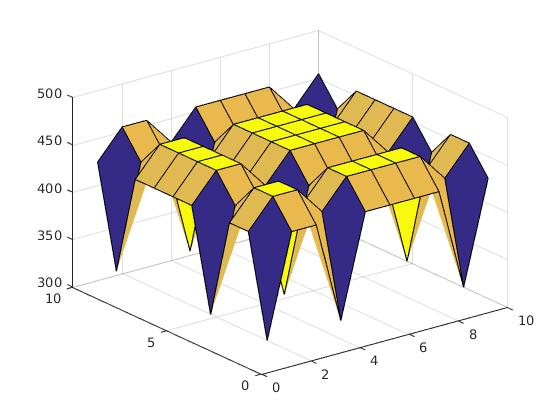
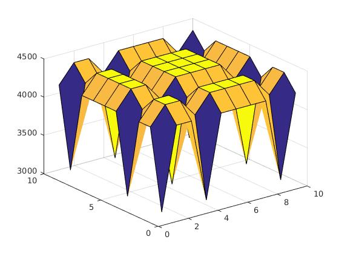
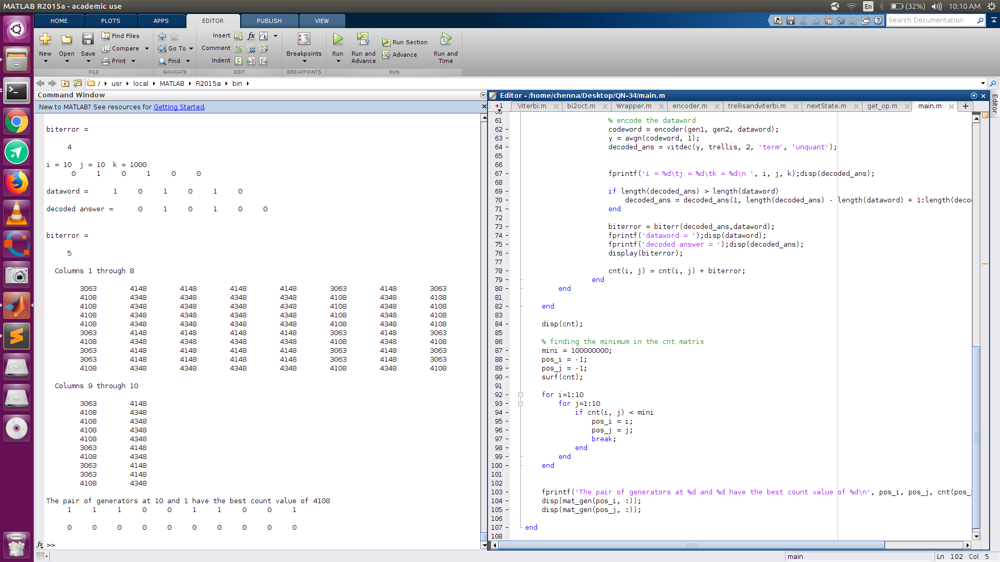
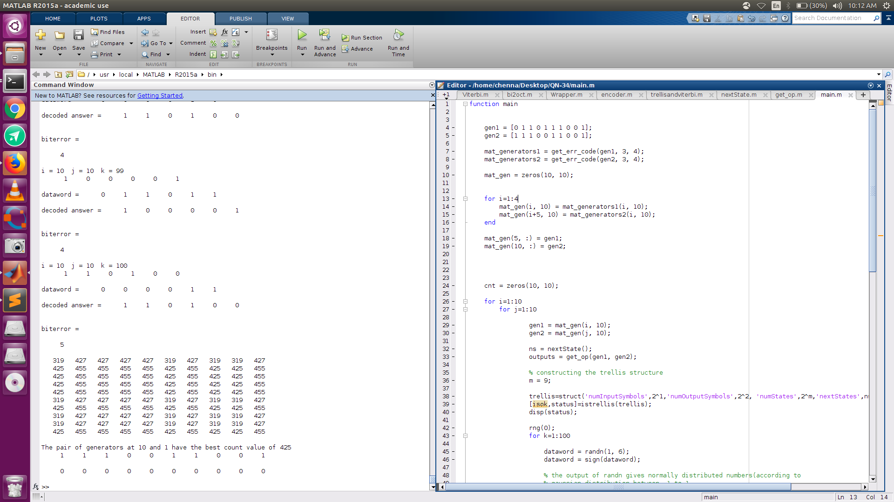

# Convolutional-Coding
This repository contains code for choosing the best pair of generator polynomials for convolutional coding with constraint length of 10

### Convolution Coding

#### Problem Statement:  
    Demonstrate convolutional coding with constriant length = 10, and rate = 1/2.

<b>Explanation of Files:</b>

We have divided this project into 5 files.

<b>Flow of control:</b> 

We will only call main.m function from the terminal. We have chosen 6-bit datawords for consideration. The main.m functin makes a call to all the other functions specified.

<b>Explanation of files:</b>

__main.m :__ This is the main function that needs to be called for implementing this convolution code. We are considering a set of 10 generator polynomials. We aim to find the best
 pair of generator polynomials. I have considered the two polynomials specified at the beginning of the file. I have considered other generator polynomials which
 differ from the specified ones by 3 bits. the get_err_code() function returns such a set if generators. Next, we consider 100 datawords for evaluation. These datawords
 are the same for all the pairs of polynomials, because I am **seeding the random number generator** at the beginning of every 'k' loop. Next, I introduce white gaussian  noise 
 into the dataword. Then the vitdec function is used to decode the correct answer. The amount of error is accumulated in cnt(i, j) matrix, which is finally used 
 to find the best pair of polynomials. Finally **surf()** function is used to construct a 3D graph.
 
Note: nextState() function is used to construct the nestStates for all the 2^m states. Similarly, outputs matrix is also constructed for every new pair of
generators. Both these are critical to building the **trellis** structure. the **istrellis()** function is used to check the validity of the trellis structure.
It returns *isok*, which is a boolean value, and also returns a string *status*, containing debug information.

**encoder.m :** This function is used to convert the dataword into the codeword. 

*Arguments:* 
- dataword : which needs to be encoded
- gen1 : first generator polynomial
- gen2 : second generator polynomial

*Returns:*
Returns the encoded codeword

**get_err_code.m:**  Returns a variant of the specified generator polynomial
*Arguments:*
* codeword: codeword whose variants are required
* x : the number of differing bits in the answer, wrt to the specified codeword
* N : Number of these required codewords

**get_op.m:** Returns the outputs for all possible states and the two input symbolss(0 and 1). It does this by using the two generators and the values in the m flip flops.
**nextState.m:** Returns the matrix containing nextStates for all the states and the two input combinations. 

The visualization of the number of errors which were *not* recognised by the pair of polynomials (i, j): 
 

Information during execution of the program:
 

 
Error incurred by all the pairs of generators:
 

<b>Limitations:</b>
 

1. We have only considered 6-bit datawords and around 1000 such words. But a more comprehensive study needs to be conducted in order to find the best pair of
generator polynomials for production purposes.
2. Usage of the Fano algorithm might improve the overall efficiency of this process, but here we have used the Viterbi algorithm.
3. Usage of soft-decoding in Viterbi algorithm is experimentally shown to produce better results. But we have used *hard* decoding mechanism in this code.

